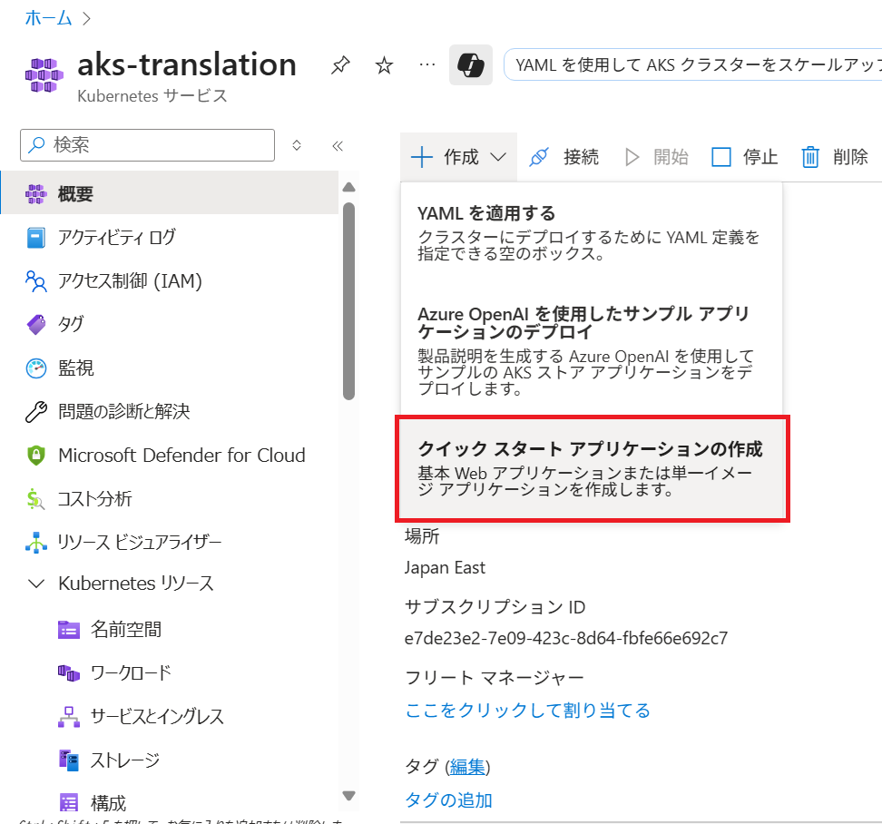
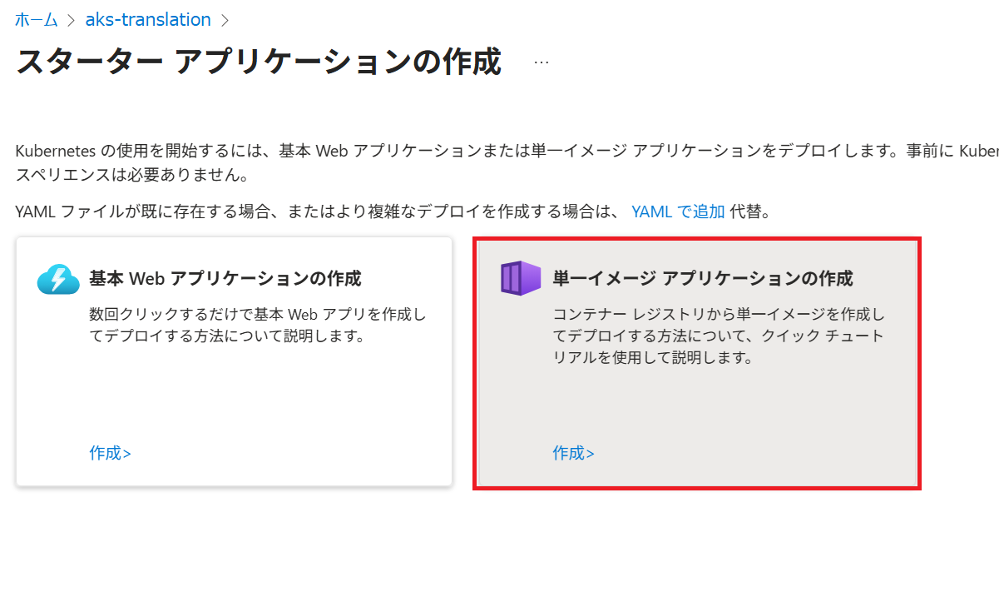
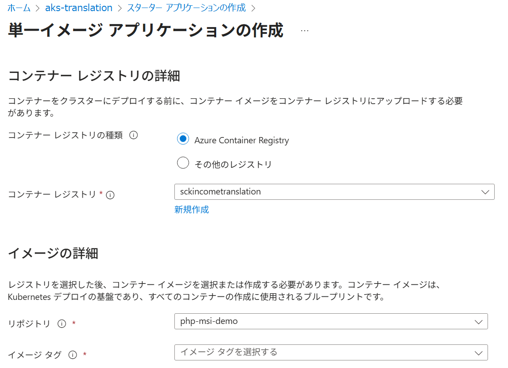
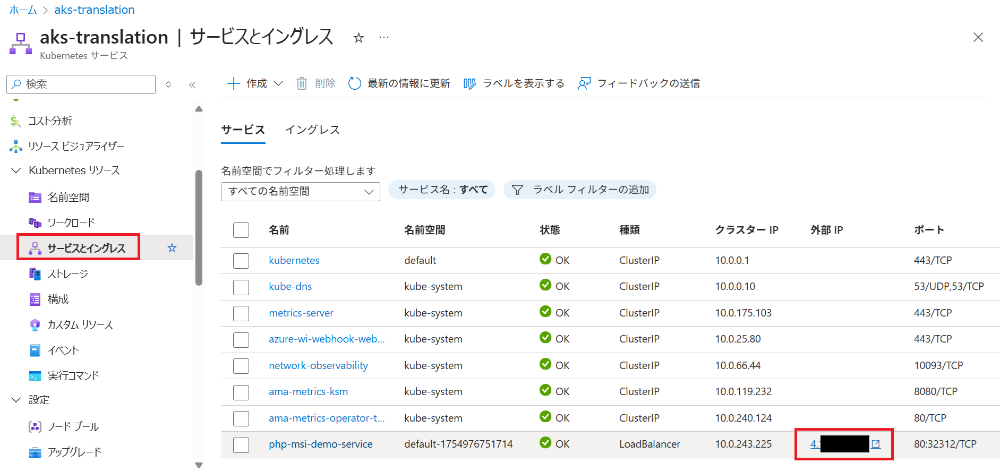

# Azure-MI-REST-API-Auth

Examples of using Azure Managed Identity in AKS and App Service to authenticate and call the Azure OpenAI API.

## Replace $apiUrl and $modelName in index_aks.php and index_app.php

```php
$modelName = "<YOUR_MODEL_NAME>";
$apiUrl = "<YOUR_OpenAI_API_URL>";
```

## Build and Push Docker Image

Build your Docker image locally and push it to your Azure Container Registry

## Create and Deploy App in AKS






## Test Authentication

Once deployed, access your service using the external IP:
http://[your-service-ip]/?page=aks
